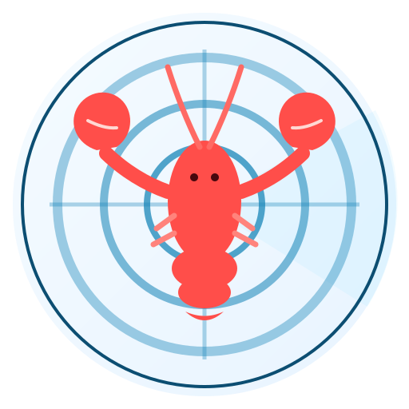

<p align="center">
  
</p>

# ClawRadar

Final release: **v1.0.0**

ClawRadar is a Next.js dashboard for visualizing publicly exposed OpenClaw instances worldwide. It includes a world map view, aggregation panels, and IP lookup against the latest synced dataset.

## Project Status

This project is now frozen.

- Active development is paused.
- GitHub Actions workflows were removed.
- Data sync is expected to be triggered manually if needed.

## Core Capabilities

- Global exposure map with zoom-based aggregation layers
- Country distribution charts
- IP search endpoint: `POST /api/exposure/search-ip`
- Snapshot aggregation from Neon/Postgres

## Tech Stack

- Next.js 16 (App Router)
- React 19 + TypeScript
- Tailwind CSS v4
- shadcn/ui + Radix primitives
- react-leaflet + OpenStreetMap
- recharts

## Quick Start

### 1) Requirements

- Node.js 20+
- pnpm (this repository uses pnpm only)

### 2) Install dependencies

```bash
pnpm install
```

### 3) Configure environment

Copy `.env.example` to `.env.local`, then set at least:

```bash
DATABASE_URL=postgresql://...
NETLAS_ENCRYPTION_KEY=your_random_secret
NETLAS_API_KEYS=key1,key2
NETLAS_QUERY=(http.title:"OpenClaw Control") OR (http.body:"openclaw-app") OR (http.body:"__OPENCLAW_CONTROL_UI_BASE_PATH__")
NETLAS_BASE_URL=https://app.netlas.io
NETLAS_MAX_PAGES=10
NETLAS_START_STEP=20
NETLAS_TIMEOUT_MS=30000
NETLAS_INCLUDE_RAW_PAGES=false
```

### 4) Run sync manually

```bash
pnpm netlas:validate
```

### 5) Start local app

```bash
pnpm dev
```

Open `http://localhost:3000`.

## Scripts

- `pnpm dev`: start development server
- `pnpm build`: build production bundle
- `pnpm start`: start production server
- `pnpm lint`: run lint checks
- `pnpm format:check`: run formatting and lint-style checks
- `pnpm verify`: run `format:check + lint + build`
- `pnpm test:netlas-core`: run Netlas sync core tests
- `pnpm netlas:fetch`: fetch Netlas data to local backup
- `pnpm netlas:validate`: sync Netlas data into Neon

## API

### `POST /api/exposure/search-ip`

Request body:

```json
{
  "ip": "8.8.8.8"
}
```

Possible `status` values:

- `matched`
- `not_found`
- `invalid`
- `error`

## Repository Layout

```text
app/                    Next.js pages and API routes
components/             UI and domain components
lib/                    Data processing and utilities
scripts/                Local scripts (sync/fetch helpers)
docs/                   Project docs
public/                 Static assets
data/backups/exposure/  Optional local backups (gitignored)
```

## Documentation

See [`docs/README.md`](docs/README.md) for detailed technical documents.

## Final Release Notes

See [`RELEASE.md`](RELEASE.md) for the final release announcement and maintenance policy.

## License

MIT License. See [`LICENSE`](LICENSE).

## Disclaimer

This project is intended for security research and defensive analysis. Use responsibly and comply with applicable laws, regulations, and platform terms.
